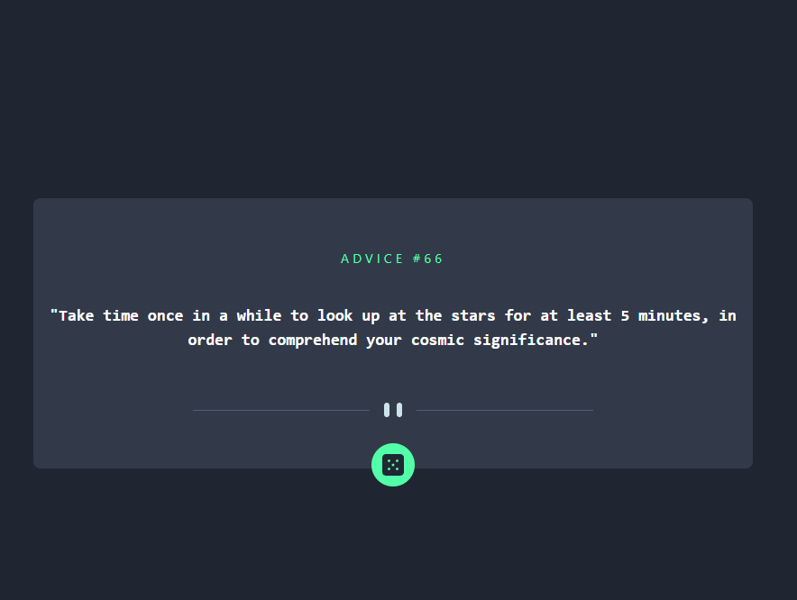
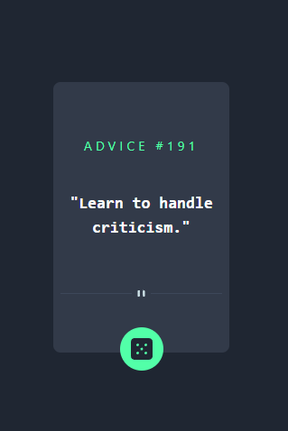
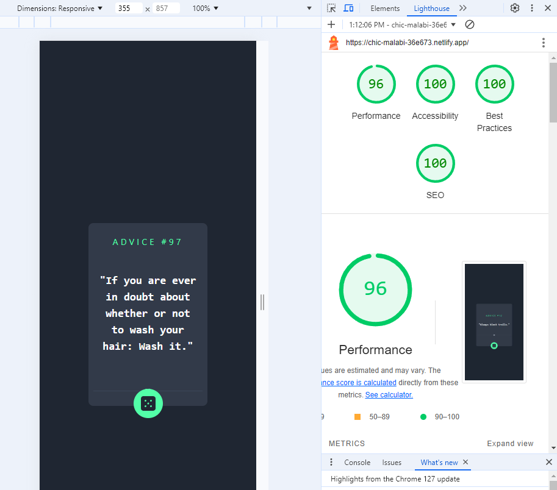
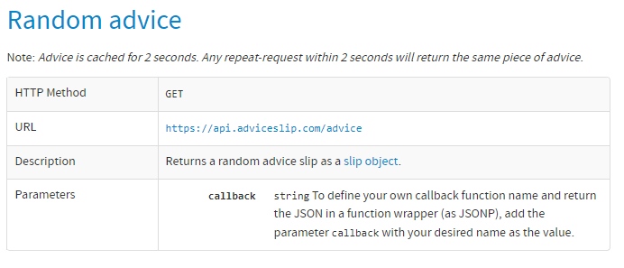
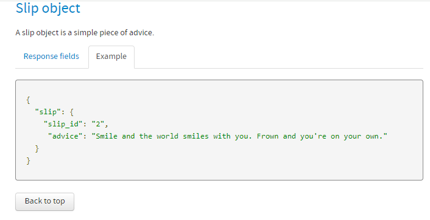

# Advice Generator App

This project entailed creating the Advice Generator App with both mobile and web responsive designs. It was React-based advice generator app that fetches and displays random advice using the Advice Slip API. The app handles loading states, errors, and data fetching with useEffect and asynchronous functions, providing a seamless user experience.


## Table of contents

- [Overview](#overview)
  - [The challenge](#the-challenge)
  - [Screenshots](#screenshots)
  - [Links](#links)
- [My process](#my-process)
  - [Built with](#built-with)
  - [What I learned](#what-i-learned)
  - [Continued development](#continued-development)
  - [Useful resources](#useful-resources)
- [Author](#author)

## Overview

This project involved replicating a design layout given for desktop and mobile for a Advice Generator App with special features.

### The challenge

Users should be able to:

- View the optimal layout for the app depending on their device's screen size
- See hover states for all interactive elements on the page
- Generate a new piece of advice by clicking the dice icon

### Screenshots

Desktop Version:



Mobile Version:



Lighthouse Report:



Advice Generator API:



Advice Generator API Data Object:




### Links

- Live Site URL: [Advice Generator App Laura Dev](https://chic-malabi-36e673.netlify.app/)
- Solution URL: [Laura Dev Frontend Mentor Solution](https://www.frontendmentor.io/solutions/reactjs-tailwindcss-vite-responsive-mobile-and-web-advice-generator-QU2F5o3b_K)

### My Process

I started by setting up TailwindCSS, ReactJS, and my GitHub repository. I also configured the README template, added all design assets, integrated Google Fonts, and defined the color scheme. Before beginning the project, I ensured that all commits were successfully pushed to GitHub.

Next, I reviewed the design layout to determine which sections would be components.

I began by ensuring the background color covered the entire height and width of the screen. I used the `App.css` file to specify the `html`, `body`, and `root` elements with a class name to achieve full width and height. In the root element, I applied the class to meet these specifications with a full background color. Then, I worked on displaying the advice from the API generator. I extracted the advice property from the data object and displayed the advice text in the JSX. After displaying the advice, I noticed it would overflow and become difficult to read. I addressed this by adding a static size class in `App.css` to ensure the div always maintained a specific size. 

Next, I implemented functionality to display a new piece of advice when the user clicked the dice button icon. I created a function to fetch the advice, called this function in the `useEffect`, and attached an `onClick` event to the button. I positioned the button at the bottom of the static-size box using the `absolute` class for the button container and updated flexbox properties. Finally, I added a hover effect to the button to create a neon green glow using the `box-shadow` property.

With the foundation of the app completed, I focused on refining the details. I changed the website tab icon to a specified icon, updated the font to the requested Manrope font weight, and added letter spacing to the `h1` to space out the letters more.

Afterwards, I reviewed all my code, added comments, and updated my README with my process.


### Built with

- Semantic HTML5 markup
- CSS custom properties
- Flexbox
- CSS Grid
- Mobile-first workflow
- [React](https://reactjs.org/) - JS library

### What I learned

I refreshed my knowledge and learned new information on various topics. These topics are written from the perspective of being informative and less personal for my knowledge:

1. **APIs in Website Development** - An API (Application Programming Interface) enables different software applications to share information and interact with each other. It provides a set of instructions that allow software developers to access features and functions, facilitating communication between two pieces of software. The application sending the request is the client, and the application sending the response is the server.

2. **Try-Catch Block** - This construct handles exceptions and errors that may occur during the execution of a block of code. The `try` block contains the code that might throw an error, while the `catch` block contains the code to handle the error if it occurs. The code inside the `try` block is executed line by line. If no errors occur, the `catch` block is skipped. If an error occurs, control is transferred to the `catch` block.

3. **JSON Parsing** - JSON (JavaScript Object Notation) parsing is the process of converting a JSON string into a JavaScript object. JSON is a data interchange format that is easy for humans to read and write. JavaScript objects allow you to easily access and manipulate the data.

4. **JavaScript Object Fundamentals** - An object is a collection of key-value pairs where each key is associated with a value. The values can be of any data type.

5. **useEffect Hook** - This hook provided by React allows you to perform side effects in function components. Side effects can include data fetching and manually changing the DOM. In this code, you want to fetch the advice data as soon as the component mounts. With `useEffect`, you ensure the data fetching happens right after the component is rendered. The empty dependency array (`[]`) ensures the effect only runs once.

6. **useEffect Dependencies** - The `useEffect` hook can take dependencies to control when the effect runs. Common dependencies include state variables, props, context values, derived values, empty arrays, and no dependencies. If you have no dependencies, the effect will run after every render.

7. **Loading State** - The loading state is initialized to `true` when the component mounts. An asynchronous function fetches the data, and during this time, the loading state remains `true`. The component checks the loading state to determine what to render.

8. **Asynchronous Function** - An asynchronous function operates asynchronously via the event loop, allowing the program to execute other code while waiting for the operation to complete. Async functions are used for operations that take time to complete.

9. **API Data** - To determine which properties are available from the API response, you can refer to the API documentation. An example of the Advice Slip API response:
   ```json
   {
     "slip": {
       "id": 45,
       "advice": "Your advice text here."
     }
   }

### Continued development

I will continue to learn more about TailwindCSS, ReactJS and streamline my process of building a website. I want to learn more about fetching data from API sites and understanding asynchronous functions. 

### Useful resources

- [Manrope Google Font](https://fonts.google.com/specimen/Manrope) - This Google Font was specified by style guide for the project
- [Advice Slip API](https://api.adviceslip.com/) - This API was specified for the project

## Author

- Website - [Laura V](https://lauradeveloper.com/)
- Frontend Mentor - [@lavollmer](https://www.frontendmentor.io/profile/lavollmer)
- Github - [@lavollmer](https://github.com/lavollmer)